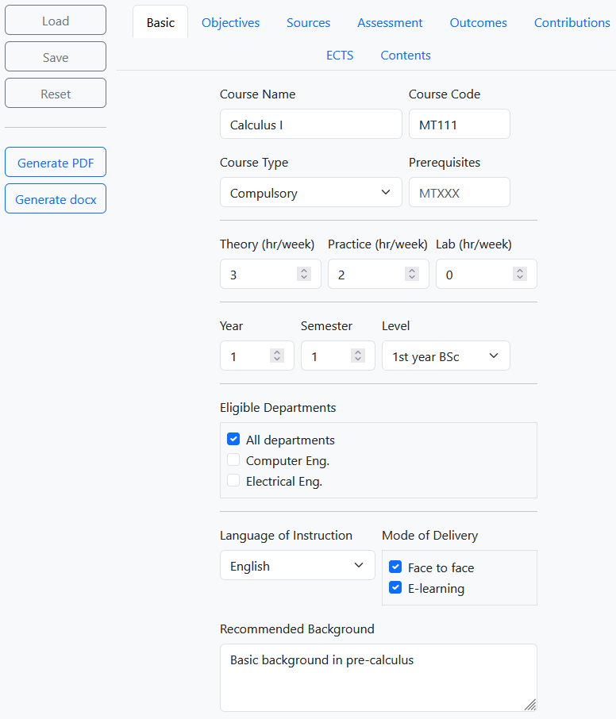

# Syllabus creator

This is a course syllabus generator. The form collects information from the user and produces either PDF or docx file.

Open the docx file with LibreOffice not MS Word.

Usage of LaTeX for PDF generation is under development.



## Motivation

* To have consistent format
* To avoid losing time with formatting
* To let national and ECTS credit to be calculated programatically to avoid mistakes

## Abilities

* Handles & and Microsoft-encoded quotes “ ” so you can just copy/paste from Word
* Handles Turkish characters

## Required packages

phpoffice/phpword (install with ```composer require phpoffice/phpword```)
LibreOffice (install to the current folder with folder name libre)

You will see
```
composer.json
composer.lock
vendor (folder)
```
in the current folder. All installation files are in the current folder only.

## Optional packages

A LaTeX distribution

## Testing

The code has been tested with

* TeX Live 3.14.
* MixTeX 4.21.
* Ubuntu 19.04
* Windows 10
* LibreOffice 25.8.1

## Usage

* Open index.html
* Fill in form fields.
* Or click Load to load data from JSON file, if there is any. For convenience, MT111 is available.
* Click Generate PDF to generate PDF of the syllabus.
* Click Generate Word to generate docx file of the syllabus.
* Optionally, click Save to save form data in JSON file.