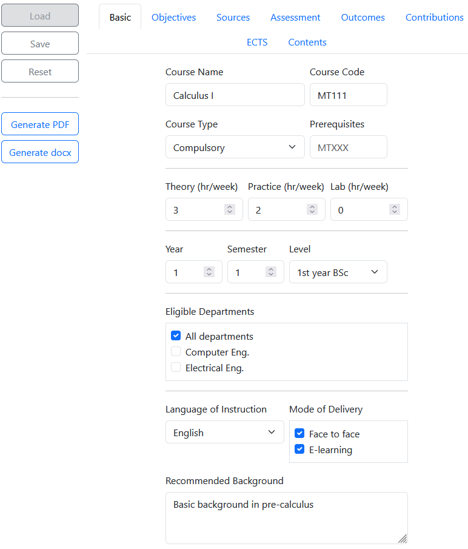

# Syllabus creator

This is a course syllabus generator. The form collects information from the user. Respective fields in LaTeX or Word template are replaced to produce PDF or Word file.



## Motivation

* To have consistent format
* To avoid losing time with formatting

## Abilities

* Handles & and Microsoft-encoded quotes “ ” so you can just copy/paste from Word
* Handles Turkish characters

## Required packages

phpoffice/phpword (install with ```composer require phpoffice/phpword```)
You will see
```
composer.json
composer.lock
vendor (folder)
```
in the current folder. All installation files are in the current folder only.

## Optional packages

A LaTeX distribution 

## Testing

The code has been tested with

* TeX Live 3.14.
* MixTeX 4.21.
* Ubuntu 19.04
* Windows 10

## Usage

* Open index.html
* Fill in form fields.
* Or click Load to load data from JSON file, if there is any. For convenience, MT111 is available.
* Click Generate PDF to generate PDF of the syllabus.
* Click Generate Word to generate Word file of the syllabus.
* Optionally, click Save to save form data in JSON file.